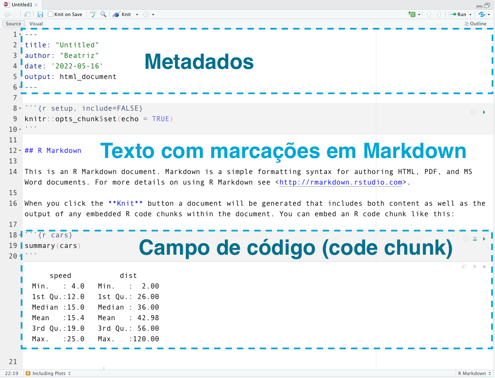
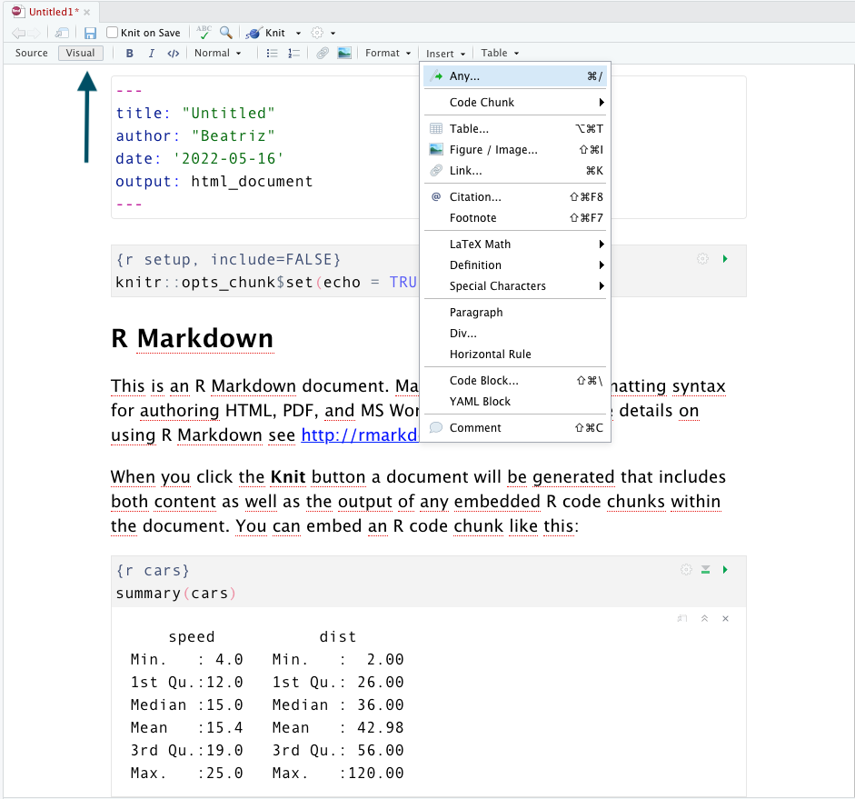

```{r setup, include=FALSE}
knitr::opts_chunk$set(echo = TRUE)
```

O principal tipo de arquivo utilizado em programação em R base [@R-base] é o arquivo de extensão `.R`, que armazena códigos escritos na linguagem R e que pode conter comentários (precedidos por hastags: `# `). Apesar de ser muito utilizado, é um formato que é útil para pessoas que programam. Portanto, os resultados provenientes das análises utilizando este tipo de arquivo podem ser adicionadas manualmente em outros documentos criados com o foco de realizar a comunicação dos resultados (como artigos, teses, apresentações e outros tipos de documentos científicos). 

Essa abordagem, apesar de ser muito utilizada, apresenta um ponto negativo: ao desvincular o arquivo final do código que gera as análises, a possibilidade de erros cometidos ao realizar a atualização manual dos arquivos aumenta. 

Uma outra abordagem de realização de análises e escrita científica é a utilização do pacote R Markdown [@R-rmarkdown], que possibilita unir códigos e seus resultados, textos, tabelas, referências, entre outros. O  R Markdown também possibilita gerar diversos tipos de arquivos, como PDF, HTML, Word e Powerpoint. A vasta comunidade de R também desenvolveu diversos pacotes que possibilitam utilizar o R Markdown para gerar documentos como: livros [@bookdown2016; @R-bookdown], apresentações em HTML [@R-xaringan], blogs científicos [@blogdown2017; @R-blogdown; @R-distill], textos científicos [@R-pagedown; @R-rticles], entre outros.

O arquivo disponibilizado pelo pacote R Markdown possui a extensão `.Rmd`.
Este arquivo apresenta a seguinte estrutura, ilustrada pela Figura \@ref(fig:ide-rstudio-rmd):

```{r ide-rstudio-rmd, echo=FALSE, fig.align="center", fig.cap="Captura de tela da IDE RStudio, mostrando um novo arquivo R Markdown",  out.width="70%"}

```

-   **Metadados** - Uma seção de metadados, que apresenta códigos `YAML`.
    Esta seção apresenta informações que serão usadas para gerar o arquivo final, como por exemplo: título do documento, autoria, data, formato que será gerado (chamado de *output*), entre outros.
    É necessário cuidado ao editar essa seção, pois coisas simples como indentação incorreta ou fechamento incorreto de textos, podem resultar em um erro ao gerar o relatório.
    Essa seção deve estar sempre no início do documento, e é delimitado por três traços antes e depois da seção: `---`.

-   **Campos de códigos** - Nos campos de código (também chamados de *code chunks*) podemos adicionar códigos em R (e também em algumas outras linguagens).
    Os chunks são delimitados por três crases, e a linguagem deve ser especificada entre chaves.
    Caso queira adicionar chunks com código em Python, é necessário ter o pacote [reticulate](https://rstudio.github.io/reticulate/) [@R-reticulate] instalado.
    Exemplo de um chunk que apresenta código em R:

```` md
```{r}`r ''`
1 + 1 
```
````

-   **Textos marcados com Markdown** - Textos marcados com a linguagem de marcação Markdown podem ser adicionados ao longo do relatório, fora das demarcações do YAML e dos Chunks. A funcionalidade recente do RStudio chamada "Visual editing mode" possibilita visualizar o arquivo, apresentando botões que auxiliam a criar as marcações em markdown (Figura \@ref(fig:visual-editor) ).

```{r visual-editor, echo=FALSE, fig.align="center", fig.cap="Captura de tela da IDE RStudio, mostrando o Visual editing mode",  out.width="70%"}

```

Para gerar um documento a partir de um arquivo `.Rmd`, é necessário pressionar o botão *Knit*, ou utilizar a função `rmarkdown::render()`. É importante que todas as etapas da análise estejam no documento, em ordem que deverão ser executadas. Além disso, é uma boa prática carregar os pacotes e bases de dados que serão utilizados na análise em um campo de código no início do arquivo (após a sessão de metadados). Caso tenha algum código que gere erro ao longo da análise, o arquivo final não será gerado. Portanto, outra boa prática é gerar o arquivo final com frequência (através do*Knit* ou da função `rmarkdown::render()`), pois assim é possível identificar mais rápido possíveis modificações na análise que geraram o erro.

A atividade prática sobre 'Documentos dinâmicos em R Markdown', a ser realizada no Treinamento Brasileiro de Ciência Aberta, será focada no uso de R Markdown em textos científicos, mostrando como podemos estruturar análises em projetos do RStudio [@rstudio]. 

Existem muitos livros e manuais que tratam sobre R Markdown e que são fontes importantes de consulta, como @rmarkdown2018, @rmarkdown2020.

# Referências

```{r include=FALSE}
knitr::write_bib(c("reticulate", "rmarkdown", "here",
                   "bookdown", "blogdown", "distill",
                   "xaringan", "pagedown", "rticles"), file = "packages.bib")
```
